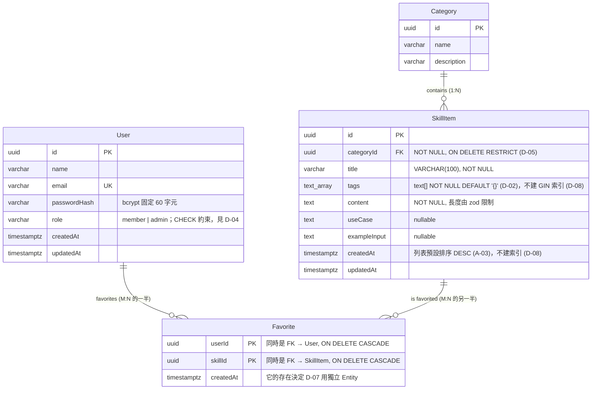

# 資料模型設計 — Prompt / Skill 收藏庫

> 狀態：**草稿（設計中）** — 待決策欄位標記為 `❓ 待決定`
> 依據：[PRD.md](../PRD.md) 第十三、十五節
> 流程參考：[backend-workflow.md](../backend-workflow.md) Step 3
> 建立：2026-08-03

**使用方式**：先填完「二、待決策項目」與「三、關聯設計」，再寫 Entity 程式碼。
每個 `❓` 都是一次設計判斷，寫下**你選的方案 + 理由 + 放棄了什麼**——成果發表第 4 點（角色權限與資料結構怎麼設計）和第 10 點（哪些是自己的判斷）會直接用到這份紀錄。

---

## 一、PRD 給定的事實

以下欄位來自 PRD 第十三節，是需求方**已經決定**的部分，不需要重新設計，但需要補完技術細節。

### User

| 欄位 | PRD 說明 | 型別 | nullable | unique | 索引 | 備註 |
|---|---|---|---|---|---|---|
| `id` | 使用者 ID | UUID | NO | YES (PK) | PK | 見 D-01 主鍵型別 |
| `name` | 顯示名稱 | VARCHAR(50) | NO | NO | — | 長度上限？ |
| `email` | 登入信箱或帳號 | VARCHAR(320) | NO | YES | UNIQUE | 見 D-03 |
| `passwordHash` | 密碼雜湊，不要存明碼 | VARCHAR(60) | NO | NO | — | bcrypt 輸出固定 60 字元 |
| `role` | `member` 或 `admin` | VARCHAR(20) | NO | NO | CHECK | 見 D-04；不使用資料庫 enum |
| `createdAt` | 建立時間 | TIMESTAMPTZ | NO | NO | — | 幾乎所有表都該有 |
| `updatedAt` | 更新時間 | TIMESTAMPTZ | NO | NO | — | 同上 |
| `deletedAt` | 軟刪除時間 | TIMESTAMPTZ | YES | NO | — | 用於軟刪除（未來做停用類別時可用） |

### Category

| 欄位 | PRD 說明 | 型別 | nullable | unique | 索引 | 備註 |
|---|---|---|---|---|---|---|
| `id` | 類別 ID | UUID | NO | YES (PK) | PK | |
| `name` | 類別名稱 | VARCHAR(50) | NO | YES | UNIQUE | 類別名稱可以重複嗎？ |
| `description` | 類別說明 | TEXT | YES | NO | — | PRD 沒說是否必填 |
| `createdAt` | 建立時間 | TIMESTAMPTZ | NO | NO | — | 幾乎所有表都該有 |
| `updatedAt` | 更新時間 | TIMESTAMPTZ | NO | NO | — | 同上 |
| `deletedAt` | 軟刪除時間 | TIMESTAMPTZ | YES | NO | — | 用於軟刪除（未來做停用類別時可用） |


### SkillItem

| 欄位 | PRD 說明 | 型別 | nullable | unique | 索引 | 備註 |
|---|---|---|---|---|---|---|
| `id` | Prompt / Skill ID | UUID | NO | YES (PK) | PK | |
| `title` | 標題 | VARCHAR(100) | NO | NO | — | 搜尋會用到（FR-10），`ILike` 模糊搜尋走不到 B-tree 索引 |
| `categoryId` | 所屬類別 ID | UUID | NO | NO | **不建** | FK → Category，`ON DELETE RESTRICT`（D-05）。見 **D-08** |
| `tags` | 標籤陣列 | TEXT[] | **NO**（預設 `'{}'`） | NO | **不建** | D-02 方案 B。GIN 索引留到需要時再加，見 **D-08** |
| `content` | Prompt / Skill 內容 | TEXT | NO | NO | — | 長度由 zod 限制（A-06） |
| `useCase` | 適用情境 | TEXT | YES | NO | — | 見下方「如何判斷必填」 |
| `exampleInput` | 範例輸入，可選 | TEXT | YES | NO | — | PRD 明說可選 |
| `createdAt` | 建立時間 | TIMESTAMPTZ | NO | NO | **不建** | 列表預設排序 `DESC`（A-03），但資料量不到，不需索引 |
| `updatedAt` | 更新時間 | TIMESTAMPTZ | NO | NO | — | |
| `deletedAt` | 軟刪除時間 | TIMESTAMPTZ | YES | NO | — | 用於軟刪除（未來做停用帳號時可用） |

> **陣列欄位為何不該 nullable**：若 `tags` 允許 null，「沒有標籤」就有 `null` 和 `[]` 兩種表示法，程式每次都要判斷兩種情況。設成 `NOT NULL DEFAULT '{}'`，空狀態只有一種。**同一個語意有兩種表示法，就是 bug 的來源。**

> **如何判斷哪些欄位必填**：PRD 第十四節的錯誤處理清單只列了「標題空白 → 400」和「內容空白 → 400」，**沒有列適用情境或標籤空白**。這是需求方對「哪些是必填」的間接答案——用錯誤處理清單反推欄位必填性，比憑感覺猜可靠。

### Favorite

| 欄位 | PRD 說明 | 型別 | nullable | 備註 |
|---|---|---|---|---|
| `userId` | 會員 ID | UUID | NO | FK → User，**複合 PK 第 1 欄**，`ON DELETE CASCADE` |
| `skillId` | Prompt / Skill ID | UUID | NO | FK → SkillItem，**複合 PK 第 2 欄**，`ON DELETE CASCADE` |
| `createdAt` | 收藏時間 | TIMESTAMPTZ | NO | 它的存在決定了 D-07 必須用獨立 Entity |

> PRD 沒給 Favorite 一個 `id` 欄位——結論是**刻意的**。`(userId, skillId)` 就是複合主鍵，見 D-06。

---

## 二、待決策項目

> 填寫格式：**選擇** / **理由** / **放棄的方案與代價**

### D-01 主鍵型別：自增整數 vs UUID

| 方案 | 優點 | 缺點 |
|---|---|---|
| 自增整數（`increment`） | 短、可讀、索引效率好、除錯方便 | 可被猜測（`/skills/1` → `/skills/2` 枚舉）、多資料庫合併時衝突 |
| UUID | 不可猜測、可在應用端先產生、分散式友善 | 較長、索引較大、肉眼難辨識 |

**引導問題**
- 你的 API 會把 id 放在 URL 上（`GET /skills/:id`）。如果使用者把 id 從 1 改成 2，會看到別人的資料嗎？在這個專案會有問題嗎？
- 如果換成「使用者的私人筆記」這種功能，答案會不一樣嗎？

**我的決定**：
- 使用 UUID

**理由**：
- 由系統自動產生

**放棄的方案與代價**：

---

### D-02 `tags` 怎麼存 ⭐ 本專案最值得想清楚的一題

PRD 說 tags 是「標籤陣列」，PostgreSQL 有四種存法：

| 方案 | 資料庫層做法 | 查詢「含某 tag」 | 優點 | 缺點 |
|---|---|---|---|---|
| A. `simple-array` | TypeORM 的偽陣列：實際存成單一 varchar，逗號分隔（`"vue,api,test"`） | 字串 `LIKE '%vue%'` | 最簡單，一個欄位搞定 | **無法精準比對**（搜 `api` 命中 `rapid`）、tag 不能含逗號、無法建有效索引、無法統計、改名要全表重寫 |
| **B. PostgreSQL 原生 `text[]`** | 真正的陣列型別 | `tags @> ARRAY['api']`（精準）、`&&`（任一） | 真陣列語意、**可建 GIN 索引**、精準比對、熱門統計可用 `UNNEST` 做到、寫入極簡單 | PostgreSQL 專屬、改名要 UPDATE 全表、無 tag 唯一清單（錯字會累積）、無法附加屬性 |
| C. `jsonb` 陣列 | 存成 JSON 陣列 | jsonb 運算子（可 GIN 索引） | 保留陣列語意、可精準比對、可索引、**彈性最高**（可存巢狀/物件） | 對「純字串陣列」是殺雞用牛刀、查詢語法較特殊 |
| D. 獨立 Tag 表 + M:N 中間表 | 正規化：`tag` 表 + `skill_tags` 表 | JOIN | **唯一 tag 清單防錯字**、改名改一筆、tag 可有屬性（顏色/排序）、熱門統計最自然、可做管理頁 | +2 張表、每次查詢要 JOIN（防 N+1）、寫入要 find-or-create + transaction、可能要額外做 tag 管理頁 |

**四方案能力對照**

| 能力 | A `simple-array` | B `text[]` | C `jsonb` | D 獨立表 |
|---|:---:|:---:|:---:|:---:|
| 精準篩選 tag | ❌ | ✅ | ✅ | ✅ |
| 可建有效索引 | ❌ | ✅ GIN | ✅ GIN | ✅ B-tree |
| 熱門 tag 統計 | ❌ | ✅ `UNNEST` | ✅ | ✅ 最自然 |
| 改 tag 名稱 | 全表重寫 | 一句 UPDATE | 一句 UPDATE | ✅ 改一筆 |
| 防錯字（唯一清單） | ❌ | ❌ | ❌ | ✅ |
| tag 附加屬性 | ❌ | ❌ | 勉強 | ✅ |
| 寫入複雜度 | 極低 | 極低 | 極低 | 高 |
| 額外表數量 | +0 | +0 | +0 | **+2** |
| 查詢需 JOIN | 否 | 否 | 否 | **是** |

**引導問題**（先自己回答，再選方案）
1. PRD 的 US-11「作為會員，我想用標籤篩選資料」——這句話對三個方案的可行性各是什麼？方案 A 篩選 tag 時，怎麼避免搜 `api` 命中 `rapid`？
2. 如果後台管理者打錯字，把 `vue3` 打成 `veu3`，五十筆資料都要改。三個方案各要做什麼事才能改完？
3. 如果之後想做「熱門標籤」或「tag 自動完成」，哪些方案能做、哪些不能？
4. 反過來想：這個專案只剩 18 天，MVP 的 tag 篩選是 Could 級（PRD 第二十節加分項）。**多做的正規化，值得嗎？**
5. 如果你選了簡單方案，未來要升級到方案 C，需要做哪些事？（提示：資料搬移 + API 相容）這個「未來的成本」你願意接受嗎？

> 這一題沒有唯一正確答案。重點是你能說出**為什麼在「這個專案、這個時程」選這個方案**——這正是發表時「哪些是 AI 建議但我自己做了判斷」的好素材。

**我的決定**（✅ 2026-08-03）：**方案 B — PostgreSQL 原生 `text[]`**，**先不建 GIN 索引**（見「索引策略」）

```ts
@Column('text', { array: true, default: () => "'{}'" })
tags!: string[]
```

**理由**（依重要性）：

1. **讓 tag 篩選（US-11）真的可用**。方案 A 做不到精準比對（搜 `api` 會命中 `rapid`），而這是 PRD 第二十節的加分項。
2. **成本幾乎等同方案 A**：一個欄位、一行 decorator、寫入不需特殊處理，但能力差很多。
3. **未來的路沒被堵死**：熱門統計、自動完成都能用 `UNNEST` 做出來；真要升級到方案 D，也只是一次資料搬移（`UNNEST` 出來塞進 tag 表），不會比現在做更難。
4. **M:N 的學習需求已由 Favorite 滿足**。Favorite 是 PRD 必做的 M:N 中間表，還帶額外欄位（`createdAt`）與防重複約束，是比 tag 更好的 M:N 教材。多做一組 tag M:N 學到的是重複的東西。
5. **時程**：18 天內要完成 Phase 1-6，工時應優先投入 Phase 2（JWT + 權限，PRD 佔 20 分且最不熟）。

**放棄的方案與代價**：

- 放棄 **D（獨立 Tag 表）** ← 原本傾向的方案。代價：無法防錯字（`vue3` / `Vue3` / `vue-3` 會並存）、tag 改名要 UPDATE 全表、無法做 tag 管理頁或給 tag 加屬性。**緩解措施**：後台表單對 tag 做輸入正規化（trim + 轉小寫），能擋掉大部分錯字。
- 放棄 **C（jsonb）**：`tags` 是固定形狀的字串陣列，用不到 jsonb 的巢狀彈性。判斷準則是**資料形狀會演化時用 jsonb，形狀固定時用原生型別**。
- 放棄 **A（`simple-array`）**：它在用字串模擬陣列，而資料庫已有真正的陣列型別。

**「這樣會不會過度設計？」的判斷準則**（本次討論的產出，值得記住）：

> 過度設計不是「功能多不多」，而是**為「可能不會發生的未來」付「現在就要付的成本」**。

三個檢查問題：
1. PRD 現在需要它嗎？（tag 篩選是 Could 級 → 不強需要 → 傾向簡單）
2. 不做，以後補做會不會很痛？（`text[]` → 獨立表 = 一次搬移腳本，痛但可控 → 可以晚做）
3. 做了，現在會不會拖慢核心功能？（+2 表、find-or-create、N+1 風險 → 會 → 傾向不做）

三題都指向方案 B。反過來說，若 PRD 要求「tag 管理後台」或「tag 要有顏色」，第 1 題答案就變了，方案 D 才是對的。**同一個技術方案在不同 context 下對錯是相反的。**

---

### D-03 `email` 的唯一性與大小寫

**引導問題**
- `Admin@Example.com` 和 `admin@example.com` 應該是同一個帳號嗎？
- 如果直接對 email 加 unique 約束，上面兩筆能同時存在嗎？
- 要在哪一層處理？（寫入前正規化成小寫 / 資料庫用大小寫不敏感的欄位型別 / 查詢時用 `ILike`）三種各有什麼副作用？
- 如果只在查詢時用 `ILike`，unique 約束還有效嗎？

**我的決定**：
- `email` 欄位加 unique 約束，寫入前正規化成小寫

**理由**：
- 這是最簡單、最安全的做法。資料庫層保證唯一性，應用層保證大小寫一致。

---

### D-04 `role` 怎麼存：字串 vs 資料庫 enum vs 獨立角色表

| 方案 | 優點 | 缺點 |
|---|---|---|
| varchar + `CHECK` 約束 | 簡單、不使用 enum，資料庫層也能擋住錯值 | 新增角色仍需 migration 更新約束 |
| PostgreSQL `enum` 型別 | 資料庫層保證只有合法值 | 新增角色要 migration，且 PostgreSQL 改 enum 有限制 |
| 獨立 roles 表 + FK | 最有彈性，可做細粒度權限 | 對兩種角色的專案是過度設計 |

**引導問題**
- 這個專案只有 `member` / `admin` 兩種角色，未來 18 天內會增加嗎？
- 如果 seed script 不小心寫成 `role: 'Admin'`（大寫 A），`requireRole('admin')` 會發生什麼事？哪個方案能在**寫入時**就攔下這個錯？
- TypeScript 的 union type（`'member' | 'admin'`）能防住這個錯嗎？為什麼不能？（提示：TS 型別在執行期還存在嗎？）

**我的決定**：
- 使用 `VARCHAR(20)` 搭配 `CHECK (role IN ('member', 'admin'))`，不使用 PostgreSQL `enum` 型別

**理由**：
- 維持欄位的可攜性，避免 PostgreSQL `enum` 的型別維護限制
- 資料庫層仍能保證只有合法值，避免大小寫錯誤
- 目前只有 `member` / `admin` 兩種角色，不需要為此建立獨立角色表

---

### D-05 `categoryId` 是否必填 + 刪除類別的行為

PRD 第十五節：「管理者刪除已有資料的類別 → 阻擋刪除或提醒先移動資料」

**引導問題**
1. 一筆 SkillItem 可以沒有類別嗎？（`categoryId` nullable 嗎？）PRD 第十節 FR-07 沒明說，你的選擇會影響什麼？
2. PRD 說「阻擋刪除」——這個「阻擋」你要在哪一層做？
   - 只在 service 層先查有沒有子資料，有就回 400/409
   - 只靠資料庫的 `ON DELETE RESTRICT`
   - 兩層都做
   三種各有什麼優缺點？如果只靠資料庫約束，使用者會看到什麼錯誤訊息？
3. 如果選「提醒先移動資料」而不是「阻擋」，需要多做什麼 API？（時程夠嗎？）
4. `ON DELETE CASCADE` 在這裡為什麼是**危險**的選擇？（想像管理者刪掉一個類別，結果底下 50 筆 Prompt 都消失了）

**我的決定**：
- `categoryId` nullable：false（必填）每筆 SkillItem 都要有類別
- 刪除行為（DB 層）：`ON DELETE RESTRICT`
- 攔阻位置（哪幾層）：兩層都做

**理由**：
- 每筆 SkillItem 都必須有類別
- 刪除類別時，`ON DELETE RESTRICT` 保證資料庫層不會誤刪
- 兩層都做的攔阻，使用者會看到友善的錯誤訊息

---

### D-06 Favorite 的主鍵設計 ⭐ 對應 PRD 邊界情境「不要產生重複資料」

PRD 第十五節明確要求：「同一會員重複收藏同一筆資料 → 不要產生重複資料」，且第十四節要求重複收藏回 **409**。

三種主鍵方案：

| 方案 | 主鍵 | 防重複機制 |
|---|---|---|
| A. 複合主鍵 | `(userId, skillId)` 一起當 PK | 主鍵本身就保證唯一 |
| B. 代理主鍵 + 複合 unique | 獨立 `id` 當 PK，另加 `UNIQUE(userId, skillId)` | 靠 unique 約束 |
| C. 只有 `id`，靠程式檢查 | 獨立 `id` | 寫入前先 `SELECT` 檢查 |

**引導問題**（這題和 TODO.md Phase 4 的引導問題是同一個核心）
1. 方案 C 的「先查再寫」：如果使用者手速很快連點兩次收藏按鈕，兩個請求幾乎同時進來，會發生什麼事？
   ```txt
   請求 A：SELECT → 沒有 → 準備 INSERT
   請求 B：SELECT → 沒有 → 準備 INSERT     ← A 還沒寫進去
   請求 A：INSERT ✅
   請求 B：INSERT ✅  ← 產生了兩筆重複資料
   ```
   這個現象叫什麼？（提示：race condition）
2. 有了資料庫約束後，**還需要在程式碼裡檢查嗎**？如果不檢查，直接 INSERT 撞到約束，資料庫會丟出什麼？你的 API 要怎麼把它變成 PRD 要求的 409 而不是 500？
3. 方案 A（複合主鍵）和方案 B（代理主鍵 + unique）在**功能上**差別不大，但如果之後要做「取消收藏」的 API，兩者的 URL 設計會一樣嗎？（`DELETE /favorites/:skillId` vs `DELETE /favorites/:favoriteId`——PRD 第十二節用的是哪一種？）
4. 這張表未來會被怎麼查？「我的收藏」是 `WHERE userId = ?`，「這篇被誰收藏」是 `WHERE skillId = ?`。複合索引 `(userId, skillId)` 對哪一種查詢有效、對哪一種無效？（提示：複合索引的最左前綴原則）
5. 刪除 SkillItem 或 User 時，相關的 Favorite 該怎麼處理？這裡的 `ON DELETE` 該選什麼、為什麼和 D-05 的答案不同？

**我的決定**（✅ 2026-08-03）：**方案 A — 複合主鍵 `(userId, skillId)`**

- 主鍵方案：複合主鍵，**欄位順序 `userId` 在前**（順序有意義，見下）
- 唯一約束：不需額外加——主鍵本身就是唯一約束
- 索引：主鍵自動建立複合索引 `(userId, skillId)`，不需額外索引
- ON DELETE 行為：`userId` → **CASCADE**；`skillId` → **CASCADE**

**理由**：

1. **代理主鍵永遠不會被使用**。PRD 第十二節的 API 是 `DELETE /favorites/:skillId`，不是 `/favorites/:favoriteId`。`userId` 從 token 來、`skillId` 從 URL 來，**兩者剛好組成複合主鍵**——多一個 `id` 欄位是純成本。
2. **少一個索引**。方案 B 會有兩個 B-tree（PK 索引 + unique 索引），其中 PK 索引沒有任何查詢會用到。方案 A 的主鍵索引同時兼任防重複的角色。
3. 防重複由主鍵天然保證，不需要額外的 unique 約束。

**放棄的方案**：B（代理主鍵 + unique）。它符合「每張表都該有單一代理主鍵」的團隊慣例，若未來 Favorite 需要被其他表以單一 FK 引用，B 會比較方便——但這個需求在本專案不存在。

#### 複合主鍵的欄位順序：為什麼 `userId` 必須在前

複合索引遵守**最左前綴原則**——索引只能從最左欄位開始使用：

| 查詢 | `(userId, skillId)` | `(skillId, userId)` |
|---|:---:|:---:|
| 我的收藏 `WHERE userId = ?`（FR-13 **必做**） | ✅ 走索引 | ❌ 全表掃描 |
| 這筆被誰收藏 `WHERE skillId = ?` | ❌ 全表掃描 | ✅ 走索引 |
| 檢查是否已收藏 `WHERE userId = ? AND skillId = ?` | ✅ | ✅ |

PRD 必做的是「我的收藏」（FR-13），所以 `userId` 放前面。
未來若列表要顯示「收藏數」（`WHERE skillId = ?`），再單獨加一個 `skillId` 的索引即可。

#### 為什麼這裡是 CASCADE，而 D-05 是 RESTRICT

> **判斷準則：子資料離開父資料還有獨立價值嗎？有 → RESTRICT；沒有 → CASCADE。**

| 關聯 | 子資料的性質 | 選擇 |
|---|---|---|
| Category → SkillItem | Prompt 內容是**有獨立價值的資產**。CASCADE 會讓管理者誤刪一個類別就毀掉底下 50 筆 Prompt | **RESTRICT**（D-05） |
| User → Favorite | 收藏只是**關聯紀錄**，使用者不存在了，紀錄沒有意義 | **CASCADE** |
| SkillItem → Favorite | 同上，指向不存在項目的收藏就是垃圾資料 | **CASCADE** |

同一個問題在不同關聯上答案相反——這正是為什麼**每個 FK 都要單獨決定**，而不是套用 ORM 預設值。

#### 已釐清的技術細節（2026-08-03 討論產出，實作時直接用）

**1. 防重複的正解是資料庫唯一約束，不是應用層排隊**

- 唯一約束由資料庫在**同一個原子操作**裡檢查，兩個併發 INSERT 只有一個能成功
- 曾考慮用**佇列**序列化請求 → 判斷是用錯工具：佇列解決的是「吞吐量與可靠性」（削峰、非同步、重試），不是唯一性。而且除非全站只有一個 worker 且完全序列執行，多 worker 一樣會併發
- 原則：**資料完整性交給資料庫**。應用層永遠有 race condition 的縫隙，資料庫約束沒有

**2. Upsert 的陷阱：`DO NOTHING` 分不出「新增成功」和「早就存在」**

PRD 要求重複收藏回 **409**，但 `ON CONFLICT DO NOTHING` 兩種情況都是「沒出錯」。解法是加 `RETURNING`：

```sql
INSERT INTO favorite (user_id, skill_id) VALUES ($1, $2)
ON CONFLICT DO NOTHING
RETURNING *;
-- 有回傳 → 新增成功（201）
-- 沒回傳 → 早就存在（409）
```

一次往返、原子、能區分兩種狀態。

**3. 把資料庫錯誤轉成 409 的架構：兩層分工**

PostgreSQL 的 unique violation 錯誤碼是 **`23505`**。TypeORM 包成 `QueryFailedError`，判斷方式 `err.driverError?.code === '23505'`。

| 做法 | 問題 |
|---|---|
| 只在全域 middleware 把所有 `23505` 轉 409 | 訊息只能通用。但 PRD 要「已經收藏過此項目」；email 重複註冊也是 `23505`，該說「此信箱已被使用」——**同一錯誤碼、不同業務語意，全域層不知道該說哪句** |
| 只在 service 層 catch | 訊息精準，但每處都要重寫 try-catch 與 status 組裝 |
| **兩層分工**（採用） | service 認業務語意 → 拋自訂錯誤；middleware 認 HTTP → 統一輸出格式 |

```txt
service 層：
  catch 到 23505
    → throw new AppError(409, 'DUPLICATE_FAVORITE', '已經收藏過此項目')

全域 error middleware：
  是 AppError？  → 照它帶的 status / code / message 回應
  是其他 Error？ → 記 log，回通用 500「系統發生錯誤，請稍後再試」
```

分層依據：「這錯誤在業務上是什麼意思」只有 service 知道；「HTTP 要長什麼樣」只有 middleware 該管。

**待想的兩題**（Phase 3/4 實作時要回答）
- `AppError` 這個類別該放專案哪一層？（service 拋、middleware 讀，兩邊都要 import）
- service 判斷 `23505` 等於讓業務邏輯知道「我用的是 PostgreSQL」，**違反分層初衷**。這件事該誰負責？

---

### D-07 Favorite 在 ORM 裡的表達方式

TypeORM 有兩種寫法表達 M:N：

| 方案 | 寫法 | 適用時機 |
|---|---|---|
| `@ManyToMany` + `@JoinTable` | ORM 自動管理中間表 | 中間表**只有兩個 FK**，沒有額外欄位 |
| 獨立 Entity + 兩個 `@ManyToOne` | 自己定義中間表為一個 Entity | 中間表**有額外欄位**或需要被獨立查詢 |

**引導問題**
- PRD 的 Favorite 有 `createdAt`（收藏時間）。這個欄位對兩種方案分別意味著什麼？
- 如果未來要做「最近收藏的 10 筆」（依收藏時間排序），哪種方案做得到？
- 「Favorite 是不是一個實體」和「Favorite 是不是只是關聯」，判斷標準是什麼？

**我的決定**（✅ 2026-08-03）：**獨立 Entity + 兩個 `@ManyToOne`**

**理由——這題是被需求決定的，不是偏好選擇**：

TypeORM 的 `@ManyToMany` + `@JoinTable` 自動產生的中間表**只有兩個 FK 欄位，塞不進第三個欄位**。而 PRD 第十三節的 Favorite 有 `createdAt`（收藏時間）。所以 `@ManyToMany` 直接被排除。

> **判斷準則：中間表只有兩個 FK → 用 `@ManyToMany` 讓 ORM 託管；有任何額外欄位、或需要被獨立查詢/排序 → 它是一個實體，要自己定義 Entity。**

連帶好處：獨立 Entity 讓「最近收藏的 10 筆」（PRD 第二十節加分項「最近使用」）做得到——`ORDER BY createdAt DESC LIMIT 10`。用 `@ManyToMany` 的話這個功能根本沒有資料可排。

**代價**：`User` 與 `SkillItem` 之間沒有直接的 `@ManyToMany` 屬性可用，查詢「某使用者收藏的所有 SkillItem」要透過 Favorite 這一層 relation（`favorites.skill`），程式碼稍長。這是換取 `createdAt` 的必要代價。

---

### D-08 索引策略 ⭐ 這題是 AI 建議被推翻的案例

**背景**：AI 最初建議為 `tags` 建 GIN 索引、為 `createdAt` 與 `categoryId` 建索引。**用本文件 D-02 建立的三個檢查問題重新檢驗後，決定全部不建。**

| 檢查問題 | GIN / 效能索引的答案 |
|---|---|
| 1. PRD 現在需要它嗎？ | **不需要**。資料量約 10-30 筆，PostgreSQL 查詢規劃器會直接選 Seq Scan——讀索引再回表比整張表掃過去更貴。**建了也不會被使用** |
| 2. 不做，以後補做會不會很痛？ | **完全不痛**。`CREATE INDEX` 一行 SQL，不改程式碼、不用資料搬移、隨時可 `DROP`。索引是所有技術決策裡**最可逆**的一種 |
| 3. 做了會不會拖慢核心功能？ | 會。TypeORM 的 `@Index()` 無法指定 GIN，要在 migration 手動寫 raw SQL + `down()` 的 DROP，多一個維護點 |

#### 索引不是免費的

- **佔磁碟空間**（GIN 尤其大——它為陣列裡的每個元素建反向索引）
- **每次 INSERT / UPDATE / DELETE 都要同步維護** → 寫入變慢
- **小表上零效益**，規劃器根本不會選它

#### 關鍵區分：兩種索引的目的不同

| 類型 | 本專案的例子 | 要不要建 | 為什麼 |
|---|---|---|---|
| **約束性索引** | PK 索引（4 張表）、`UNIQUE(user.email)`、`UNIQUE(category.name)`、Favorite 複合 PK | ✅ **要** | 目的是**保證正確性**，不是加速查詢。沒有它就防不了重複資料 |
| **效能性索引** | `tags` GIN、`skill_item.createdAt`、`skill_item.categoryId` | ❌ **不建** | 純優化。資料量不到就是純成本 |

#### 什麼時候才該加

> **先測量再優化。** 用 `EXPLAIN ANALYZE` 看到 Seq Scan 且執行時間真的有問題，才加索引。

粗略量級：幾千筆以上開始有感，幾萬筆以上不加會痛。本專案差三個數量級。

**未來要加的話**（記錄下來，之後不用重新查）：

```sql
-- tags 陣列包含查詢
CREATE INDEX idx_skill_item_tags ON skill_item USING GIN (tags);
-- 列表排序
CREATE INDEX idx_skill_item_created_at ON skill_item (created_at DESC);
-- FK（PostgreSQL 不會自動為 FK 建索引；ON DELETE RESTRICT 的檢查會受益）
CREATE INDEX idx_skill_item_category_id ON skill_item (category_id);
```

> **發表素材**（PRD 第二十四節「哪些是 AI 建議但自己做了判斷」）：AI 建議建 GIN 索引，我用它自己提供的「過度設計三問」反過來檢驗，發現在本專案資料量下該索引不會被查詢規劃器使用，且補做的成本極低（一行 SQL、零遷移），因此決定不做。**判斷依據是「這個決定可不可逆」與「現在是否測量到問題」，而不是「這個技術是否先進」。**

---

## 三、關聯設計

先回答關聯類型，再畫圖。**FK 放錯邊是新手最常見的錯誤。**

### 3-1 關聯類型（✅ 2026-08-03 定案）

| 問題 | 答案 | 關聯類型 | 實作 |
|---|---|---|---|
| 一個 Category 有幾筆 SkillItem？一筆 SkillItem 屬於幾個 Category？ | 多筆 / **1 個** | **1:N** | FK `categoryId` 放在 SkillItem（「多」的那邊） |
| 一個 User 收藏幾筆 SkillItem？一筆 SkillItem 被幾個 User 收藏？ | 多筆 / 多個 | **M:N** | 中間表 `Favorite`（帶 `createdAt`，見 D-07） |
| 一個 User 有幾個 role？ | 1 個 | 1:1 | 所以 role 是**欄位**不是表（見 D-04） |

規則檢查：**1:N 的 FK 一定放在「多」的那邊；M:N 一定需要中間表。** ✅ 兩者皆符合。

#### 決策紀錄：Category 一度考慮做成 M:N，最後選 1:N

**曾考慮的方案**：一筆 SkillItem 可屬於多個 Category（需要 `skill_categories` 中間表）。

**放棄的理由**（依重要性）：

1. **概念會與 Tag 重疊**。Category 與 Tag 的分工是刻意的：

   | | Category | Tag |
   |---|---|---|
   | 數量 | **單選** | **多選** |
   | 語意 | 「這是什麼」——本質分類 | 「這關於什麼」——特徵標記 |
   | 集合性質 | 管理者維護的封閉集合 | 較開放 |
   | UI 用途 | 導覽、側邊選單 | 交叉檢索 |
   | 理想狀態 | 互斥且窮盡 | 重疊是正常的 |

   Category 若改成多選，就變成第二套 Tag 系統——使用者會困惑「這該放類別還是標籤」，而我要維護兩套幾乎相同的程式碼。

2. **偏離 PRD 契約**。PRD 第十三節給的是 `categoryId`（單數欄位）、第十二節的篩選是 `GET /skills?categoryId=`、第十五節「刪除有資料的類別要阻擋」也是 1:N 語意。改 M:N 這三處都要偏離。

3. **連帶成本**：+1 張表、後台表單要換多選元件、前台篩選要 JOIN、TypeORM 的 relation 增刪比單一 FK 繞。時程只剩 18 天，這些工時該留給 Phase 2 的 JWT 與權限（PRD 評分 20 分且是最不熟的部分）。

**代價**：未來若真的需要「一筆資料屬於多個類別」，要新增中間表 + 資料搬移 + 改 API 契約。判斷是這個需求在本專案不會出現——真的要交叉分類，Tag 已經能滿足。

### 3-2 ER 圖（✅ 已依 3-1 定案）

（mermaid `erDiagram` 語法：`||--o{` 一對多、`}o--o{` 多對多；`|` 必要、`o` 可選、`{` 多）



> - 圖中 id 型別依 D-01 標為 `uuid`，**四張表一致**（混用兩種主鍵型別會讓 FK 與程式碼都變醜）。
> - Favorite 的 `userId` / `skillId` **同時是複合主鍵與外鍵**，順序 `userId` 在前（最左前綴原則，見 D-06）。

**檢查清單**
- [x] 每條線的兩端符號都是想清楚後選的
- [x] 每個 1:N 的 FK 都在「多」的那邊（`categoryId` 在 SkillItem）
- [x] `tags` 反映 D-02 的決定（`text[]` 單欄位，不需額外表）
- [x] 每個 FK 都註記了 ON DELETE 行為（Category→SkillItem RESTRICT；User/SkillItem→Favorite CASCADE）
- [x] Favorite 的主鍵標示符合 D-06 的決定（複合主鍵，`userId` 在前）

✅ **資料模型設計已定稿，可以開始寫 Entity。**

---

## 四、假設清單（✅ 2026-08-03 定案）

PRD 沒寫、但實作必須有答案的事情。這些是**我的判斷**，發表時可以說明為什麼這樣假設。

| ID | 假設 | 決定 | 理由 | 影響 |
|---|---|---|---|---|
| A-01 | 列表 API 要不要分頁？ | **要，前後端都做**（前端做精簡版） | PRD 沒要求，但沒分頁的列表 API 是隱形炸彈；改 API 契約的成本遠高於加前端 UI | `GET /skills`、`GET /categories`、`GET /me/favorites` 都要 `page`/`limit`，response 要包 meta。**seed 12 筆 + `limit` 預設 10 → 剛好 2 頁**，見下方「分頁的 demo 算術」 |
| A-02 | 管理者可以收藏嗎？ | **可以** | 管理者也是使用者；PRD 只是沒提，不是禁止。且實作更簡單——只掛 `authMiddleware`，不用檢查角色 | `api-spec.md` 的 `/favorites/*` 與 `/me/favorites` 權限從 `member` 改標 **`已登入`** |
| A-03 | 列表預設排序 | **`createdAt DESC`**（新的在前） | 收藏庫的通用慣例，新增的資料要馬上看得到（後台新增後前台驗證也方便） | 排序欄位**不建索引**（D-08）：10-30 筆的 sort 成本可忽略 |
| A-04 | 有沒有註冊 API？ | **不做** | PRD 第五節非目標排除了 Email 驗證等相關流程，第六節只要求 seed 1 admin + 1 member。做註冊要多做密碼強度驗證、重複 email 處理、前端註冊頁 | 帳號只從 seed 產生；`User` 不需要註冊相關欄位（驗證狀態、驗證碼等） |
| A-05 | 搜尋要區分大小寫嗎？ | **不區分**，用 `ILike` | 使用者搜 `vue` 要能找到 `Vue`。中文無大小寫概念所以不受影響，但英文 Prompt 標題常大小寫混用 | `GET /skills?keyword=` 用 `ILike '%keyword%'`；注意**前置 `%` 的模糊搜尋走不到 B-tree 索引**，資料量大時要改方案（本專案資料量小，可接受） |
| A-06 | `content` 有長度上限嗎？ | **`TEXT` + zod 限長** | PostgreSQL 的 `TEXT` 與 `VARCHAR(n)` 儲存方式與效能完全相同（官方文件明說），唯一差別是 `VARCHAR(n)` 會在寫入時檢查長度。把長度驗證放應用層，才能回 PRD 第十四節要求的友善 400 而非資料庫錯誤 | 所有長文字欄位用 `TEXT`；zod schema 加 `.max()`；`express.json({ limit: '1mb' })` 已是第一層防線 |

> **關於 A-06 的常見誤解**：「TEXT 比 VARCHAR 慢」的說法來自 MySQL / SQL Server，在 PostgreSQL 不成立。跨資料庫的效能直覺不能直接搬。

#### 分頁的 demo 算術（A-01 補充）

**分頁能不能 demo，取決於 `seed 筆數 > limit`，不是絕對筆數。** 所以不需要塞很多假資料：

| 方案 | seed 筆數 | `limit` 預設 | 頁數 | 評估 |
|---|---|---|---|---|
| 最初建議 | 25-30 | 20 | 2 | seed 太累，假資料品質也難維持 |
| **✅ 採用** | **12** | **10** | **2** | demo 效果相同，seed 省一半以上 |
| 更省 | 10 | 6 | 2 | 可行，但 `limit=6` 有點刻意 |

**前端做精簡版**：只做「上一頁 / 下一頁」+「第 1 / 2 頁」文字，**不做頁碼列表**。成本低很多，demo 展示效果一樣。

> seed 的 12 筆要有品質——PRD 第十九節「產品用心點」提到「提供範例資料，讓第一次打開的人有東西可以測」。12 筆真實可用的 Prompt 比 30 筆 `測試資料 1`、`測試資料 2` 有價值得多。

---

## 五、Schema 管理方式

- `data-source.ts` 目前設定 `synchronize: false`（✅ 正確的預設）
- `package.json` 已備妥 `migration:generate` / `migration:run` / `migration:revert`

**引導問題**
- `migration:generate` 是「比對 Entity 與現有資料庫的差異，自動產生 migration」。它需要資料庫**已經連得上**才能跑，為什麼？
- 產生出來的 migration 檔案，你應該**直接信任並執行**，還是先讀一遍？如果它包含 `DROP COLUMN`，你想在什麼時候發現？
- `synchronize: true` 在本機開發很方便。如果你哪天改了 Entity 的欄位名稱，它會做什麼？舊欄位的資料還在嗎？

---

## 六、決定完成後的下一步

1. 依定稿寫四個 Entity（`apps/api/src/database/entities/`）
2. 把 Entity 註冊進 `data-source.ts` 的 `entities` 陣列（目前是空的 `[]`）
3. `pnpm migration:generate src/database/migrations/InitSchema` → **打開檔案讀一遍**再 run
4. `migration:run` 建表
5. 寫 seed script（1 admin + 1 member + 2-3 類別 + 5-10 筆範例資料，密碼要過 bcrypt）
6. 用 psql / DBeaver 確認四張表與資料都在（TODO.md Phase 1 驗收條件）
7. 回來把這份文件的 `❓` 全部換成實際決定，作為發表素材
